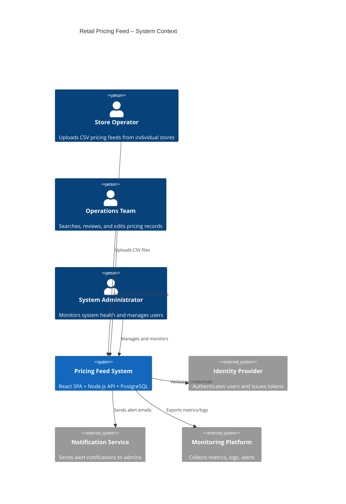
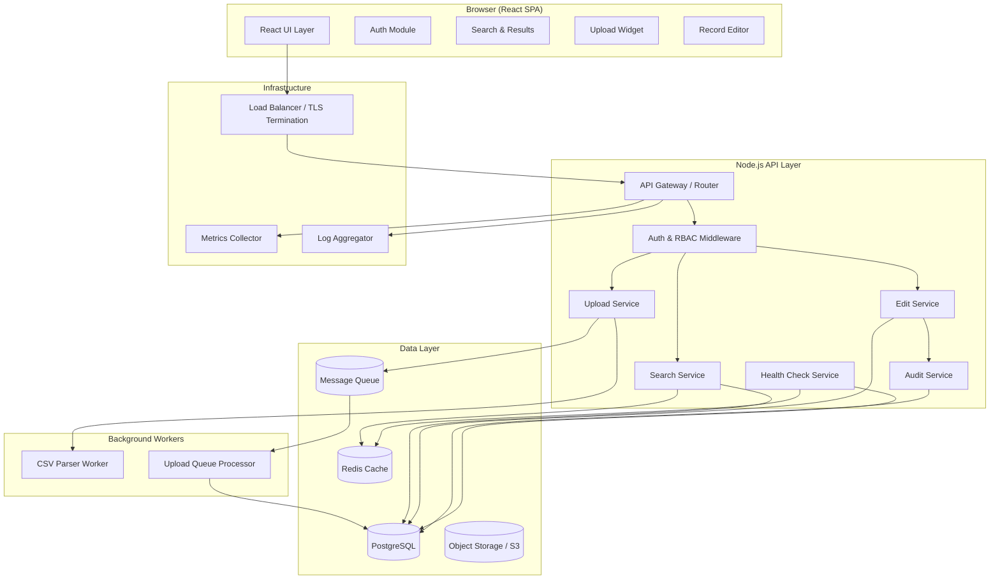

# Design Document: Retail Pricing Feed

## Overview

The Retail Pricing Feed system is a web application that enables a retail chain (3,000+ stores, multiple countries) to upload, persist, search, and manage pricing data. Store Operators upload CSV pricing feeds; Operations Teams search, review, and edit records via a React SPA backed by a Node.js API layer.

The system must handle up to 50 million pricing records, serve 100 concurrent users with sub-2-second search, process 50 MB / 200K-row CSV uploads in under 30 seconds, and maintain 99.9% availability.

## Architecture

### Context Diagram



### Solution Architecture



## Components and Interfaces

### Frontend Components (React SPA)

| Component | Responsibility |
|-----------|---------------|
| `AuthModule` | Login form, token storage, session timeout detection, redirect on 401 |
| `UploadWidget` | File selection, size/row pre-check, progress bar, upload summary display |
| `SearchPanel` | Multi-criteria form, pagination controls, result table |
| `RecordEditor` | Inline edit form, field validation, optimistic lock version tracking |
| `LocaleProvider` | Date/number formatting per user locale settings |
| `NotificationBanner` | Success/error/conflict messages |

### Backend Services (Node.js)

| Service | Responsibility |
|---------|---------------|
| `AuthService` | Credential validation, JWT issuance, session management, account lockout |
| `UploadService` | File reception, size/row limit check, delegates to CSV Parser |
| `CSVParserWorker` | Streaming parse, row validation, deduplication within file, upsert to DB |
| `SearchService` | Query construction, pagination, result capping at 10K |
| `EditService` | Field validation, optimistic lock check, persist, trigger audit |
| `AuditService` | Records field-level changes with user, timestamp, old/new values |
| `HealthService` | Liveness/readiness probes, dependency checks |
| `MetricsEmitter` | Request timing, error rates, upload durations (1-min rolling window) |
| `QueueService` | Enqueue uploads during DB unavailability, replay on recovery |

### Key API Endpoints

| Method | Path | Auth | Description |
|--------|------|------|-------------|
| POST | `/api/auth/login` | Public | Authenticate user, return JWT |
| POST | `/api/auth/logout` | Authenticated | Invalidate session |
| POST | `/api/uploads` | Store Operator | Upload CSV file |
| GET | `/api/uploads/:id/status` | Store Operator | Upload processing status |
| POST | `/api/pricing-records/search` | Authenticated | Search with criteria (POST body) |
| GET | `/api/pricing-records/:id` | Authenticated | Get single record |
| PUT | `/api/pricing-records/:id` | Operations Team | Edit record (includes version for optimistic lock) |
| GET | `/api/health` | Public | Health check endpoint |
| GET | `/api/metrics` | Internal | Prometheus-format metrics |

### Interface Contracts

**Upload Request:**
```
POST /api/uploads
Content-Type: multipart/form-data
Authorization: Bearer <jwt>

Body: file (CSV), currency (ISO 4217 code)
```

**Upload Response:**
```json
{
  "uploadId": "uuid",
  "status": "processing | completed | failed",
  "summary": {
    "totalRows": 150000,
    "validRecords": 149800,
    "rejectedRows": 200,
    "updatedRecords": 3500
  },
  "rejections": [
    { "row": 42, "reasons": ["Price is not numeric"] }
  ]
}
```

**Search Request:**
```json
POST /api/pricing-records/search
{
  "criteria": {
    "storeId": "STORE-001",
    "sku": "SKU-12345",
    "productName": "widget",
    "priceMin": 10.00,
    "priceMax": 50.00,
    "dateStart": "2024-01-01",
    "dateEnd": "2024-06-30"
  },
  "pagination": {
    "page": 1,
    "pageSize": 50
  },
  "sort": {
    "field": "date",
    "direction": "desc"
  }
}
```

**Search Response:**
```json
{
  "records": [...],
  "pagination": {
    "page": 1,
    "pageSize": 50,
    "totalRecords": 8500,
    "totalPages": 170,
    "truncated": false
  }
}
```

**Edit Request:**
```json
PUT /api/pricing-records/:id
{
  "storeId": "STORE-001",
  "sku": "SKU-12345",
  "productName": "Premium Widget",
  "price": 29.99,
  "currency": "USD",
  "date": "2024-03-15",
  "version": 3
}
```

## Data Models

### Pricing Record (Primary Entity)

```sql
CREATE TABLE pricing_records (
    id              UUID PRIMARY KEY DEFAULT gen_random_uuid(),
    store_id        VARCHAR(50) NOT NULL,
    sku             VARCHAR(100) NOT NULL,
    product_name    VARCHAR(500) NOT NULL,
    price           DECIMAL(12, 4) NOT NULL,  -- stored with extra precision, displayed per currency
    currency        CHAR(3) NOT NULL,         -- ISO 4217
    record_date     DATE NOT NULL,
    version         INTEGER NOT NULL DEFAULT 1,
    created_at      TIMESTAMPTZ NOT NULL DEFAULT NOW(),
    updated_at      TIMESTAMPTZ NOT NULL DEFAULT NOW(),
    created_by      UUID NOT NULL REFERENCES users(id),
    updated_by      UUID NOT NULL REFERENCES users(id),

    CONSTRAINT uq_store_sku_date UNIQUE (store_id, sku, record_date),
    CONSTRAINT chk_price_range CHECK (price >= 0.01 AND price <= 999999999.99),
    CONSTRAINT chk_currency_code CHECK (currency ~ '^[A-Z]{3}$')
);

-- Performance indexes
CREATE INDEX idx_pricing_store_id ON pricing_records (store_id);
CREATE INDEX idx_pricing_sku ON pricing_records (sku);
CREATE INDEX idx_pricing_date ON pricing_records (record_date DESC);
CREATE INDEX idx_pricing_product_name_trgm ON pricing_records USING gin (product_name gin_trgm_ops);
CREATE INDEX idx_pricing_composite ON pricing_records (store_id, sku, record_date DESC);
```

### Audit Trail

```sql
CREATE TABLE audit_log (
    id              UUID PRIMARY KEY DEFAULT gen_random_uuid(),
    record_id       UUID NOT NULL REFERENCES pricing_records(id),
    field_name      VARCHAR(50) NOT NULL,
    old_value       TEXT,
    new_value       TEXT,
    changed_by      UUID NOT NULL REFERENCES users(id),
    changed_at      TIMESTAMPTZ NOT NULL DEFAULT NOW(),
    action          VARCHAR(20) NOT NULL  -- 'update', 'upsert_upload'
);

CREATE INDEX idx_audit_record_id ON audit_log (record_id);
CREATE INDEX idx_audit_changed_at ON audit_log (changed_at DESC);
```

### Users

```sql
CREATE TABLE users (
    id                  UUID PRIMARY KEY DEFAULT gen_random_uuid(),
    username            VARCHAR(100) NOT NULL UNIQUE,
    password_hash       VARCHAR(255) NOT NULL,
    role                VARCHAR(20) NOT NULL CHECK (role IN ('store_operator', 'operations_team', 'admin')),
    locale              VARCHAR(10) DEFAULT 'en-US',
    failed_login_count  INTEGER NOT NULL DEFAULT 0,
    locked_until        TIMESTAMPTZ,
    last_login_at       TIMESTAMPTZ,
    created_at          TIMESTAMPTZ NOT NULL DEFAULT NOW(),
    updated_at          TIMESTAMPTZ NOT NULL DEFAULT NOW()
);
```

### Upload Tracking

```sql
CREATE TABLE uploads (
    id              UUID PRIMARY KEY DEFAULT gen_random_uuid(),
    file_name       VARCHAR(255) NOT NULL,
    file_size_bytes BIGINT NOT NULL,
    total_rows      INTEGER,
    valid_records   INTEGER,
    rejected_rows   INTEGER,
    updated_records INTEGER,
    status          VARCHAR(20) NOT NULL DEFAULT 'pending'
                    CHECK (status IN ('pending', 'processing', 'completed', 'failed', 'queued')),
    currency        CHAR(3) NOT NULL,
    uploaded_by     UUID NOT NULL REFERENCES users(id),
    started_at      TIMESTAMPTZ,
    completed_at    TIMESTAMPTZ,
    error_message   TEXT,
    created_at      TIMESTAMPTZ NOT NULL DEFAULT NOW()
);

CREATE TABLE upload_rejections (
    id          UUID PRIMARY KEY DEFAULT gen_random_uuid(),
    upload_id   UUID NOT NULL REFERENCES uploads(id),
    row_number  INTEGER NOT NULL,
    reasons     TEXT[] NOT NULL
);
```

### Security Audit Log

```sql
CREATE TABLE security_audit_log (
    id              UUID PRIMARY KEY DEFAULT gen_random_uuid(),
    user_id         UUID REFERENCES users(id),
    action_type     VARCHAR(50) NOT NULL,  -- 'login', 'logout', 'upload', 'search', 'edit', 'lockout'
    resource_type   VARCHAR(50),
    resource_id     VARCHAR(255),
    outcome         VARCHAR(10) NOT NULL CHECK (outcome IN ('success', 'failure')),
    ip_address      INET,
    details         JSONB,
    created_at      TIMESTAMPTZ NOT NULL DEFAULT NOW()
);

CREATE INDEX idx_sec_audit_user ON security_audit_log (user_id, created_at DESC);
CREATE INDEX idx_sec_audit_action ON security_audit_log (action_type, created_at DESC);
```

## Design Decisions

| # | Decision | Rationale | Alternatives Considered |
|---|----------|-----------|------------------------|
| 1 | **PostgreSQL** as primary data store | Supports 50M+ records with proper indexing, ACID transactions for optimistic locking, trigram indexes for substring search, partitioning for scale | MongoDB (weaker consistency), MySQL (less advanced indexing) |
| 2 | **Streaming CSV parsing** via worker process | Avoids loading 50 MB into memory; processes row-by-row with back-pressure. Allows file to be validated and persisted concurrently | In-memory parse (OOM risk at 200K rows), batch insert after full parse (slow, high memory) |
| 3 | **Optimistic locking** with version column | Low contention expected (different users edit different records); avoids pessimistic lock overhead; version bump on each write detects conflicts | Pessimistic locking (blocks concurrent reads), last-write-wins (data loss risk) |
| 4 | **JWT + HttpOnly cookie** for auth | Stateless API authentication; HttpOnly prevents XSS token theft; short-lived access tokens (15 min) + refresh tokens | Session-based (requires sticky sessions or shared session store at scale) |
| 5 | **Redis** for search result caching and session metadata | Sub-2s search at 50M records requires caching frequent queries; Redis provides TTL-based invalidation | In-process LRU cache (lost on restart, not shared), no cache (latency risk) |
| 6 | **Message queue for upload resilience** | Buffers uploads during DB unavailability (Req 7.2); decouples API response from processing time | Synchronous processing (blocks user, no resilience), write-ahead log file (complex recovery) |
| 7 | **pg_trgm extension** for product name search | Built-in PostgreSQL trigram matching enables case-insensitive substring (ILIKE with index support) at scale | Full-text search (word-level, not substring), Elasticsearch (operational overhead for one field) |
| 8 | **Table partitioning by record_date** (range, monthly) | 50M records benefit from partition pruning on date-range queries; maintenance (VACUUM, backups) operates on smaller partitions | No partitioning (full table scans on large date ranges), sharding (operational complexity) |
| 9 | **Decimal stored with 4 decimal places internally** | Supports ISO 4217 currencies with 0–3 minor units; avoids floating-point rounding; display rounds per currency | BIGINT cents (limits multi-currency), FLOAT (precision loss) |
| 10 | **Structured JSON logging** | Enables machine-parseable log aggregation; includes request ID correlation, response time, status code | Plain text logs (hard to query), binary formats (tooling lock-in) |

## Non-Functional Requirements Addressed

### Performance (Requirement 6)

- **Search < 2s at P95**: Composite indexes + trigram GIN index + Redis query caching (60s TTL) + result cap at 10K
- **Upload < 30s for 100K rows**: Streaming parser + batch INSERT (1000 rows per batch) + COPY protocol for bulk load
- **Page load < 3s**: Code splitting, lazy routes, CDN for static assets, gzip/brotli compression
- **100 concurrent users**: Horizontal scaling behind load balancer; connection pooling (pgBouncer); rate limiting per user

### Availability (Requirement 7)

- **99.9% uptime**: Multi-instance deployment behind LB; rolling deployments with zero downtime
- **15-min RTO**: Automated failover to read replica promoted to primary; health checks trigger failover
- **5-min RPO**: Streaming WAL replication to standby; point-in-time recovery capability
- **Upload queue**: Redis-backed queue holds up to 10K upload requests during DB unavailability; replays in order on reconnection
- **Daily backups**: pg_dump or WAL archiving to object storage with 90-day retention

### Security (Requirement 9)

- **TLS 1.2+**: Enforced at load balancer; HSTS headers; internal traffic encrypted
- **AES-256 at rest**: PostgreSQL Transparent Data Encryption (TDE) or disk-level encryption
- **Input sanitization**: Parameterized queries (prevents SQL injection); output encoding (prevents XSS); helmet middleware for HTTP headers
- **Account lockout**: 5 failed attempts → 15-min lock; logged + admin notified within 60s

### Observability (Requirement 10)

- **Health endpoint**: `/api/health` returns status of DB, Redis, queue; 3 consecutive unhealthy → alert within 60s
- **Structured logs**: Every request logged with method, path, status, duration, user ID, request ID
- **Metrics**: Prometheus-format counters/histograms for upload time, search time, error rates (1-min rolling)
- **Alert suppression**: 5-min dedup window per service to prevent alert storms

## Assumptions

1. PostgreSQL is the approved relational database (no hard constraint on a specific managed service)
2. A managed Redis-compatible cache service is available
3. An object storage service (S3-compatible) is available for raw CSV file archival
4. A message queue (Redis Streams, RabbitMQ, or SQS) is available for upload buffering
5. The load balancer handles TLS termination and provides sticky routing if needed
6. User identity provisioning (creating accounts, assigning roles) is handled outside this system by admins
7. The system does not perform currency conversion; prices are stored as-uploaded with their stated currency
8. The 50M record dataset will grow at approximately 200K records/day (1 upload per store per day)
9. Product Name substring search with pg_trgm is acceptable; full-text linguistic search is not required
10. The frontend is served as static assets from a CDN; the API is deployed separately

## Correctness Properties

*A property is a characteristic or behavior that should hold true across all valid executions of a system — essentially, a formal statement about what the system should do. Properties serve as the bridge between human-readable specifications and machine-verifiable correctness guarantees.*

### Property 1: Upload summary accounting

*For any* CSV file with N total data rows, the upload summary's `validRecords + rejectedRows` SHALL always equal `totalRows`.

**Validates: Requirements 1.1**

### Property 2: Missing column detection

*For any* CSV file whose header is missing one or more of the required columns (StoreID, SKU, Product Name, Price, Date), the error response SHALL list exactly the set of missing column names and no others.

**Validates: Requirements 1.2, 1.3**

### Property 3: Row validation identifies invalid data

*For any* CSV row where at least one field violates its validation rule (non-numeric Price, Price outside 0.01–999999.99, Date not YYYY-MM-DD, empty StoreID, or empty SKU), the row SHALL be rejected and the rejection reason(s) SHALL correspond exactly to the violated rules.

**Validates: Requirements 1.4**

### Property 4: Upsert on duplicate natural key

*For any* pricing record with key (StoreID, SKU, Date), if a new record with the same key is uploaded, the database SHALL contain exactly one record for that key with the values from the most recently uploaded data.

**Validates: Requirements 1.8, 5.1, 5.2**

### Property 5: Search results satisfy all criteria

*For any* search query specifying one or more criteria (StoreID, SKU, Product Name substring, Price range, Date range), every record in the result set SHALL satisfy all specified criteria simultaneously.

**Validates: Requirements 2.1**

### Property 6: Pagination and sort invariant

*For any* paginated search response, the page SHALL contain at most `pageSize` records (default 50, max 200), and records within a page SHALL be ordered by Date descending (or the requested sort order).

**Validates: Requirements 2.3**

### Property 7: Search matching semantics

*For any* search query, Product Name matching SHALL be case-insensitive substring (contains) with a minimum query length of 2 characters, while StoreID and SKU matching SHALL be exact (case-sensitive, full string equality).

**Validates: Requirements 2.5**

### Property 8: Result set capping

*For any* search query whose matching set exceeds 10,000 records, the response SHALL contain at most 10,000 records and the `truncated` flag SHALL be `true`.

**Validates: Requirements 2.8**

### Property 9: Edit validation correctness

*For any* edit submission, the system SHALL accept the edit if and only if: Price is numeric and within 0.01–999,999,999.99, Date matches YYYY-MM-DD format, and all required fields (StoreID, SKU, Product Name, Price, Date) are non-empty. For rejected edits, the error response SHALL identify each failing field and its violation reason.

**Validates: Requirements 3.2, 3.3**

### Property 10: Audit trail creation

*For any* successful edit operation that changes one or more fields of a Pricing Record, the system SHALL create an audit log entry for each changed field containing the previous value, new value, timestamp, and the user who made the change.

**Validates: Requirements 3.5**

### Property 11: RBAC enforcement

*For any* authenticated user and requested operation, the system SHALL permit the operation if and only if it is allowed by the user's role: Store Operator may upload and search (read-only); Operations Team may search, view, and edit. All other operations SHALL be denied with an insufficient-permissions response.

**Validates: Requirements 4.3, 4.4, 4.8**

### Property 12: Account lockout after consecutive failures

*For any* user account, if 5 or more consecutive failed login attempts occur within a 30-minute window, the account SHALL be locked for 15 minutes. The failed attempt counter SHALL reset after a successful login or after the lockout period expires.

**Validates: Requirements 4.7, 9.5**

### Property 13: Last-occurrence-wins for in-file duplicates

*For any* CSV file containing multiple rows with the same (StoreID, SKU, Date) key, only the last occurrence in file order SHALL be persisted; all earlier duplicates SHALL be discarded.

**Validates: Requirements 5.3**

### Property 14: Price rounding (half-up to currency precision)

*For any* numeric price value with more than the currency's standard decimal places, the stored value SHALL equal the input rounded to the currency's minor unit using half-up rounding (e.g., 2 decimals for USD: 10.125 → 10.13, 10.124 → 10.12).

**Validates: Requirements 5.4, 8.1**

### Property 15: Optimistic locking conflict detection

*For any* two concurrent edit operations on the same Pricing Record where both start with the same version number, the first to commit SHALL succeed and the second SHALL be rejected with a conflict error.

**Validates: Requirements 5.6**

### Property 16: Currency code validation

*For any* submitted currency code string, the system SHALL accept it if and only if it is a valid ISO 4217 three-letter alphabetic code. Invalid codes SHALL be rejected with an error identifying the invalid currency.

**Validates: Requirements 8.3**

### Property 17: UTF-8 product name round-trip

*For any* valid UTF-8 string of up to 500 characters used as a Product Name, storing and then retrieving the record SHALL preserve the exact original string without data loss or encoding corruption.

**Validates: Requirements 8.4**

### Property 18: Date storage and display format

*For any* valid date, the system SHALL store it in ISO 8601 format (YYYY-MM-DD) internally, and SHALL display it formatted according to the user's configured locale preference.

**Validates: Requirements 5.5, 8.5**

### Property 19: Input sanitization

*For any* user input containing SQL injection patterns (e.g., `'; DROP TABLE`, `1=1 OR`, `UNION SELECT`) or XSS patterns (e.g., `<script>`, `javascript:`, event handler attributes), the system SHALL reject the request before processing.

**Validates: Requirements 9.4**

### Property 20: Structured logging completeness

*For any* API request processed by the system, a structured log entry SHALL be emitted containing: response time in milliseconds, HTTP status code, request method, request path, and requesting client identifier.

**Validates: Requirements 9.3, 10.2**

### Property 21: Alert after consecutive health check failures

*For any* backend service, if 3 consecutive health checks return unhealthy status, an alert SHALL be triggered to the operations team within 60 seconds of the third failure.

**Validates: Requirements 10.4**

### Property 22: Alert suppression deduplication

*For any* service that has already triggered an alert, subsequent alert conditions for the same service within a 5-minute window SHALL be suppressed (no duplicate notification sent).

**Validates: Requirements 10.5**

## Error Handling

### Upload Errors

| Error Condition | HTTP Status | Behavior |
|----------------|-------------|----------|
| File exceeds 50 MB | 413 | Reject immediately; return error with limit exceeded |
| File exceeds 200K rows | 422 | Reject after row count check; return row limit error |
| Missing required CSV columns | 422 | Reject file; return list of missing columns |
| Row validation failures | 200 (partial success) | Process valid rows; return rejection summary |
| DB unavailable during upload | 503 | Queue upload (up to 10K); return queued status |
| Queue at capacity | 503 | Reject upload; advise retry later |
| Invalid currency code | 422 | Reject file/rows with invalid currency |

### Search Errors

| Error Condition | HTTP Status | Behavior |
|----------------|-------------|----------|
| No criteria provided | 400 | Reject with "at least one search field required" |
| Product Name query < 2 chars | 400 | Reject with minimum length message |
| Page size > 200 | 400 | Reject with max page size message |
| Query timeout | 504 | Return timeout error; suggest narrowing criteria |
| DB connection failure | 503 | Return service unavailable; log error |

### Edit Errors

| Error Condition | HTTP Status | Behavior |
|----------------|-------------|----------|
| Validation failure | 422 | Return field-level error details; do not persist |
| Optimistic lock conflict | 409 | Return conflict error with conflicting version info |
| Record not found | 404 | Return not found |
| System error on persist | 500 | Return save-failed error; retain user changes in UI |
| Unauthorized role | 403 | Return insufficient permissions |

### Authentication Errors

| Error Condition | HTTP Status | Behavior |
|----------------|-------------|----------|
| Invalid credentials | 401 | Generic "authentication failed" (no field disclosure) |
| Account locked | 423 | Return locked status with remaining lockout duration |
| Session expired | 401 | Return session-expired; redirect to login |
| Missing token | 401 | Return unauthorized; redirect to login |

### Global Error Strategy

- All errors return a consistent JSON envelope: `{ "error": { "code": string, "message": string, "details": [...] } }`
- All 5xx errors are logged with full stack trace and request context
- Client-facing error messages never expose internal implementation details
- Transient failures (DB timeout, queue full) suggest retry with exponential backoff
- Circuit breaker pattern on external dependencies (DB, Redis) to fail fast

## Testing Strategy

### Dual Testing Approach

This feature benefits from both property-based testing and traditional example-based testing:

**Property-Based Tests (PBT):**
- Library: [fast-check](https://github.com/dubzzz/fast-check) (JavaScript/TypeScript)
- Minimum 100 iterations per property test
- Each test tagged with: `Feature: retail-pricing-feed, Property {N}: {description}`
- Focus areas: validation logic, search filtering, price rounding, RBAC enforcement, data integrity invariants

**Unit Tests (Example-Based):**
- Framework: Jest (or Vitest for faster execution)
- Focus on specific examples, edge cases, integration points
- Cover: empty results, boundary values (50MB exactly, 200K rows exactly), session timeout, specific error messages

**Integration Tests:**
- Database integration with test containers (PostgreSQL)
- End-to-end upload → persist → search → edit flows
- Performance tests with representative datasets (k6 or Artillery)
- Failover/recovery scenarios

### Test Organization

```
tests/
├── unit/
│   ├── csv-parser.test.ts          # Row validation, column checking
│   ├── price-rounding.test.ts      # Rounding logic
│   ├── search-query-builder.test.ts # Query construction
│   ├── edit-validation.test.ts     # Field validation
│   ├── auth-lockout.test.ts        # Lockout counter logic
│   └── alert-suppression.test.ts   # Dedup window logic
├── property/
│   ├── upload-accounting.prop.ts   # Property 1
│   ├── column-detection.prop.ts    # Property 2
│   ├── row-validation.prop.ts      # Property 3
│   ├── upsert.prop.ts             # Property 4
│   ├── search-filter.prop.ts      # Properties 5, 7
│   ├── pagination.prop.ts         # Property 6
│   ├── result-capping.prop.ts     # Property 8
│   ├── edit-validation.prop.ts    # Property 9
│   ├── rbac.prop.ts               # Property 11
│   ├── lockout.prop.ts            # Property 12
│   ├── dedup-in-file.prop.ts      # Property 13
│   ├── price-rounding.prop.ts     # Property 14
│   ├── optimistic-lock.prop.ts    # Property 15
│   ├── currency-validation.prop.ts # Property 16
│   ├── utf8-roundtrip.prop.ts     # Property 17
│   ├── date-format.prop.ts        # Property 18
│   ├── input-sanitization.prop.ts # Property 19
│   └── alert-logic.prop.ts        # Properties 21, 22
├── integration/
│   ├── upload-flow.integration.ts
│   ├── search-performance.integration.ts
│   ├── edit-persist.integration.ts
│   ├── auth-session.integration.ts
│   └── health-check.integration.ts
└── e2e/
    ├── store-operator-flow.e2e.ts
    └── operations-team-flow.e2e.ts
```

### Property Test Configuration

```typescript
// fast-check configuration
import fc from 'fast-check';

const PBT_CONFIG = {
  numRuns: 100,       // minimum iterations per property
  verbose: true,      // show counterexamples on failure
  seed: undefined,    // random seed (set for reproducibility)
};
```

### Coverage Requirements

- Property tests: all 22 correctness properties implemented
- Unit tests: all error paths and edge cases in Error Handling table
- Integration tests: all API endpoints with database
- E2E tests: complete user journeys for both roles
- Performance tests: verify P95 latency requirements under load

